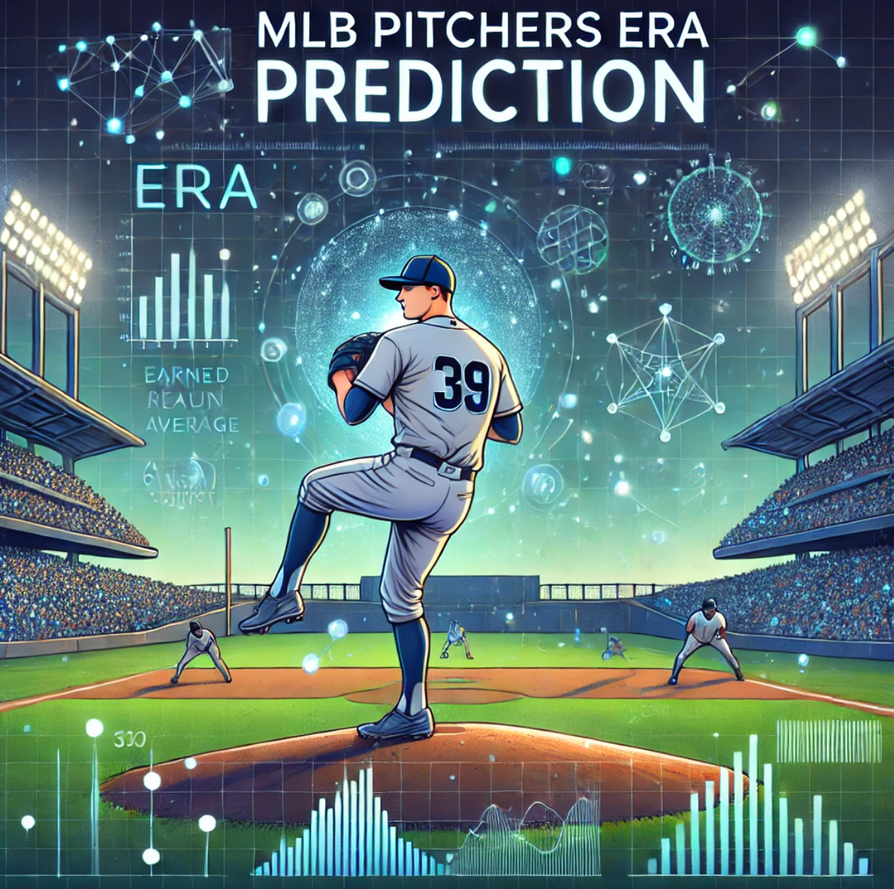

# Deep Learning from Scratch 2 Ch05 RNN (Baseball ERA Prediction with RNNs)



## 파일 구조 
- `data_preprocess.py` : 데이터 로드/전처리 + (선수별) 시퀀스 샘플 생성
- `models/`
  - `lstm.py` (PyTorch)
  - `bilstm.py` (PyTorch)
  - `gru.py` (PyTorch)
- `train_eval.py` : argparse로 옵션 선택 후 학습/평가

## 실행 예시
```bash
# period=2019, seq_length=4, LSTM
python train_eval.py --csv_path basic.csv --period 2019 --seq_length 4 --model lstm

# period=2023, seq_length=2, GRU
python train_eval.py --csv_path basic.csv --period 2023 --seq_length 2 --model gru

# period=2023, seq_length=4, BiLSTM (dropout/hidden 조정)
python train_eval.py --csv_path basic.csv --period 2023 --seq_length 4 --model bilstm --hidden 256 --dropout 0.5
```

## 옵션 설명
- `--period` : 예측하려는 타깃 연도(2019 또는 2023)
- `--seq_length` : 타깃 연도 직전 L년치 기록을 입력으로 사용(2/3/4)
- `--model` : lstm | bilstm | gru

## 핵심 아이디어(실습 포인트)
- **선수별로** 시계열을 구성해서, 서로 다른 선수 기록이 섞여 들어가는 문제를 막는다.
- 예: period=2023, L=4 → 2019~2022 입력으로 2023 ERA 예측
